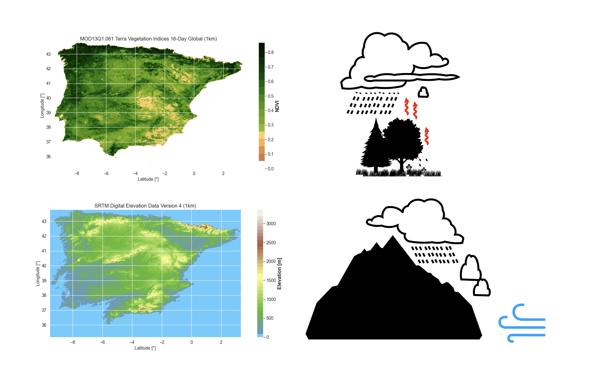

# GPM-Downscale

[![Release][release-shield]][release-url]
[![DOI][zenodo-shield]][zenodo-url]
[![MIT License][license-shield]][license-url]

Precipitation over the Iberian peninsula is downscaled using the Monthly Global Precipitaiton 
Measurement (GPM) product (version 6) from the origional resolution of 11.132km to 1km using 
Normalized Difference Vegetation Index (NDVI) and elevation data. This is a students project 
that was conducted in the Master course "remote sensing environment" at the University of Lisbon
(Faculty of Science). 

# Table of Contents
- [Introduction](#introduction)
- [Installation](#installation)
- [Usage](#usage)
- [License](#license)
- [Acknowledgments](#acknowledgments)

## Introduction
Precipitation provides the necessary water for plant growth. In areas with sufficient and regular precipitation, 
vegetation is more likely to thrive, leading to higher NDVI values. Adequate precipitation supports the 
growth of vegetation.

Elevation often influences precipitation through orographic effects.
As moist air is lifted over elevated terrain, it cools and condenses, leading 
to increased precipitation on windward slopes. On the leeward side (rain shadow),
where the air descends and warms, precipitation is reduced. 
This creates distinct precipitation patterns based on elevation of surface terrain.

The Normalized Difference Vegetation Index is generated from the Near-IR and Red bands 
of each scene as (NIR - Red) / (NIR + Red), and ranges in value from -1.0 to 1.0. 
NDVI, or Normalized Difference Vegetation Index, is a measure commonly used to 
assess the density and health of vegetation in remote sensing and satellite 
imagery. NDVI is calculated based on the reflectance of two wavelengths of light,
typically in the red and near-infrared parts of the electromagnetic spectrum.
Healthy vegetation tends to strongly reflect near-infrared light and absorb red 
light, leading to a high NDVI. 


- Negative Values (-1 to 0): These values often represent non-vegetated surfaces such as water bodies, barren land, or built-up areas.
- Low Values (0 to 0.2): These values typically indicate sparse or stressed vegetation, like shrubs or grasslands with limited greenness.
- Moderate Values (0.2 to 0.5): These values often represent moderate-density vegetation, such as croplands or deciduous forests.
- High Values (0.5 to 1): High NDVI values suggest dense and healthy vegetation, such as evergreen forests or well-irrigated croplands.



*Example of Modis Normalized Difference Vegetation Index and SRTM Digital elevation for the Iberian peninsula*


## Installation
As input sources NDVI, precipitation and elevation data are provided as images in tif format:
The files were created using Google Earth Engine and a notebook to create these
images will be uploaded in the future. 
1. The package can be installed via pip:
```
 python -m pip install git@github.com:hannihumilis/GPM-Downscale.git
```
2. Install the package
```
 python setup.py install
```
## Usage
To use this project, follow these steps:

1. Go to the `main` module and define the paths to the images, shapefile and location
to save the dataset.
   ```python
   path_to_tif       = 'PATH/GPM-Downscale/Tif/'
   path_to_shapefile = 'PATH/GPM-Downscale/iberia/iberia_merged.shp'
   path_to_save_data = 'PATH/GPM-Downscale/downscaled_files/'

   ```

3. Run the `main` module 


## License
Distributed under the MIT License. See `LICENSE` for more information.

<p align="right">(<a href="#top">back to top</a>)</p>
